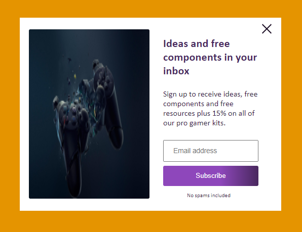
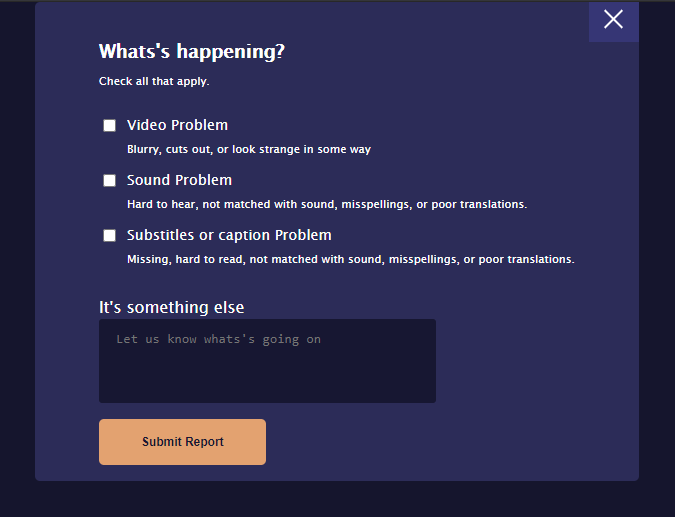
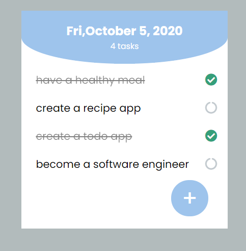
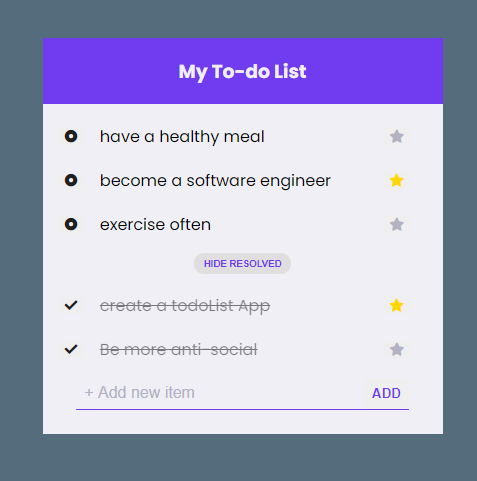
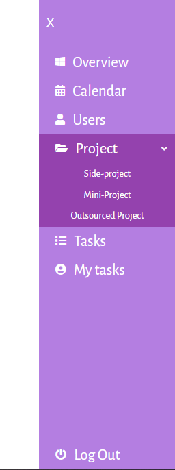
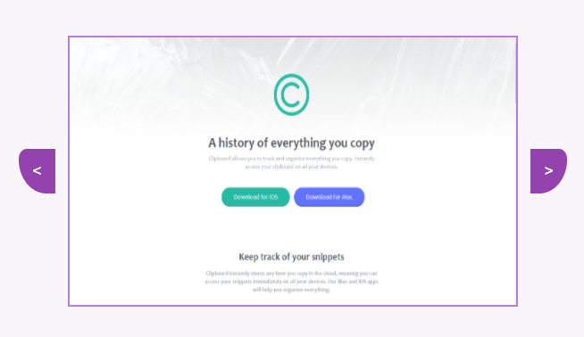
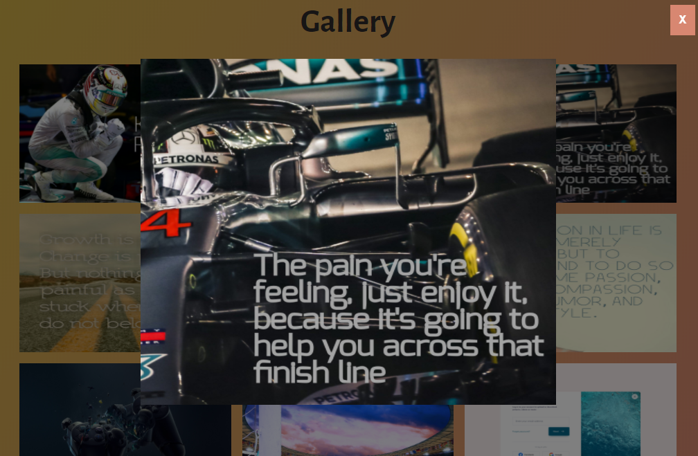
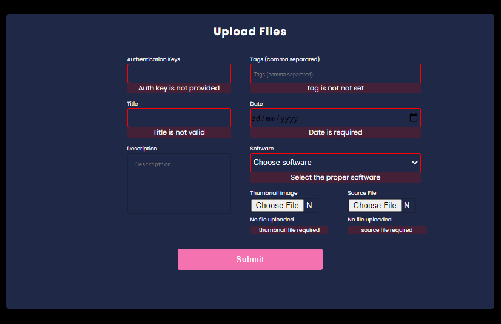
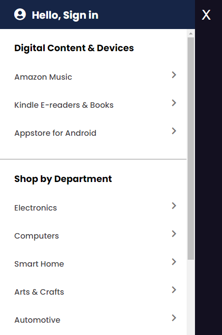
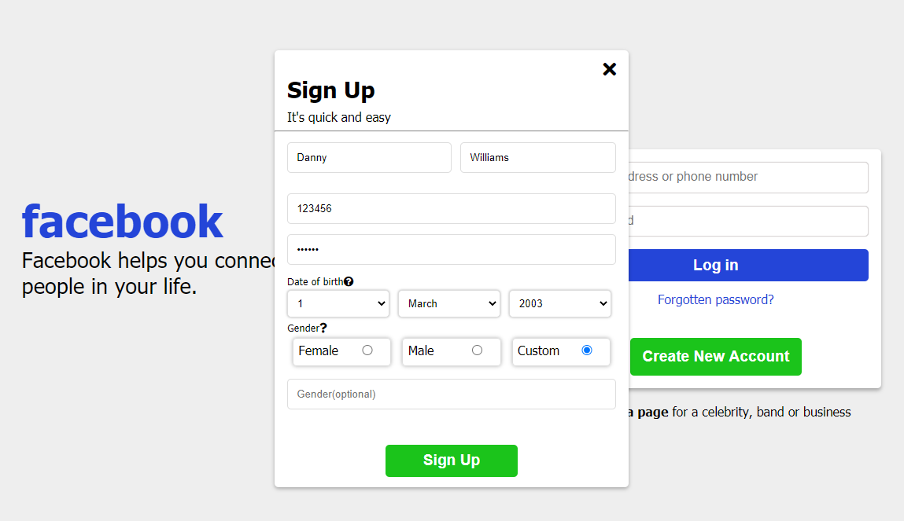

# JavaScript Mini Projects

    This repo contains mini projects like modals, todo-List, carousels, gallery, converters UI, etc: just mini components of a modern site created using HTML, CSS and most especially JavaScript.

#### List of Projects

## Modal-1 

modal design from gotten from UI design daily.

## Modal-2 

modal design from gotten from UI design daily.

## Todo-1 

Todo app design from gotten from UI design daily, app can assign new tasks, check if task is done or not.

## Todo-2 

Todo app design from gotten from UI design daily, app can assign new tasks, hide or show resolved task.

## Navbar(Off-Side canvas)

Navbar(off-side canvas), sidebar isn't visible until the hamburger icon is clicked, design gotten from UI design daily.

## Carousel-1

Carousel containing images, with side buttons for displaying previous or next image. Also, the carousel runs infinitely.

;

## Gallery1 

Collections of images, when an image is clicked, it appears in a bigger form for better viewing experience,and the image can be closed.

;

## File Upload

Simple form that uploads file plus checks for some validation before submitting it.

;

## Amazon Navbar

This is a remake of amazon website navbar.

;

## Facebook login/signup

Simple remake of facebook login/signup page.

;

